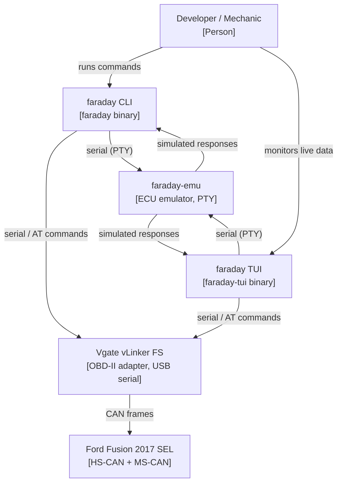
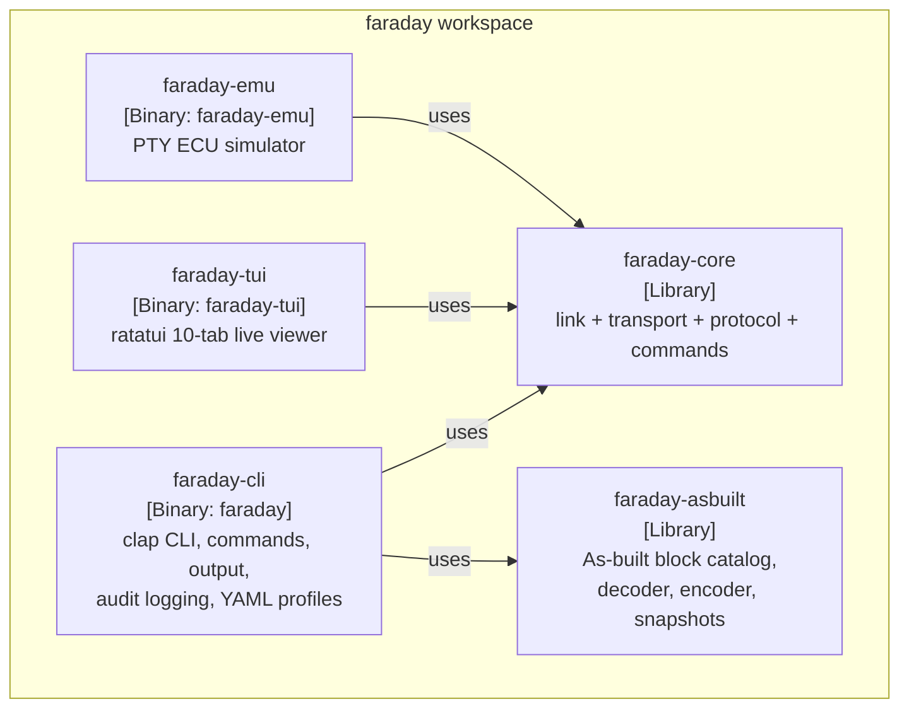
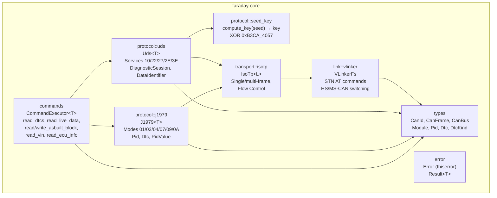
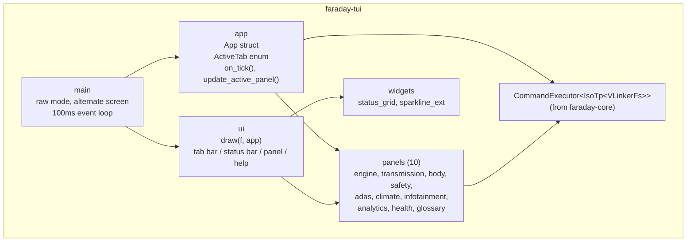
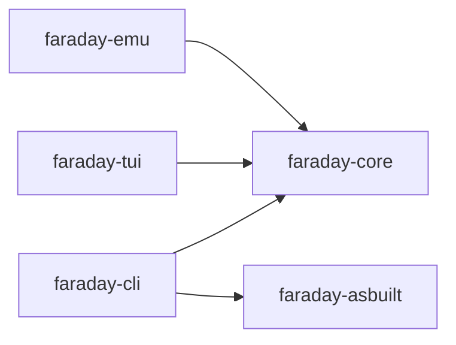
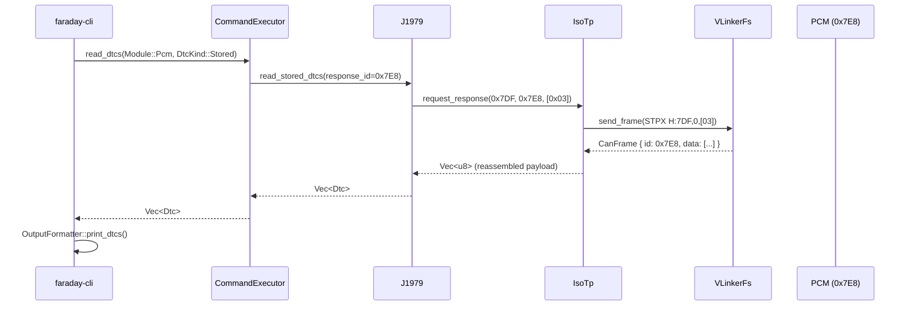
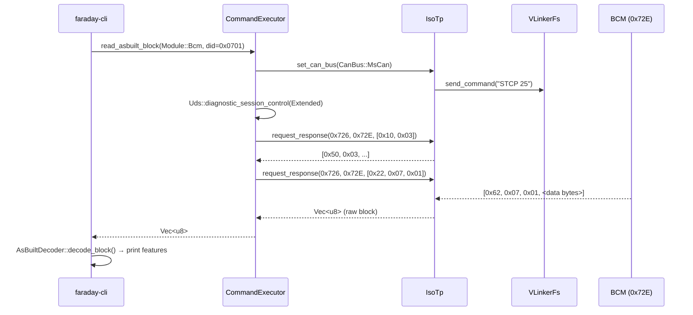
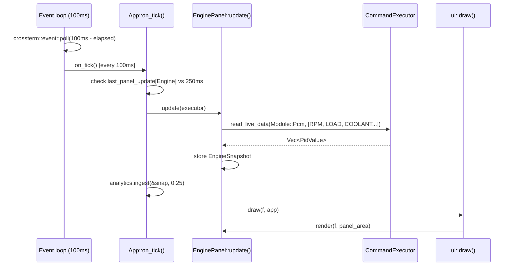
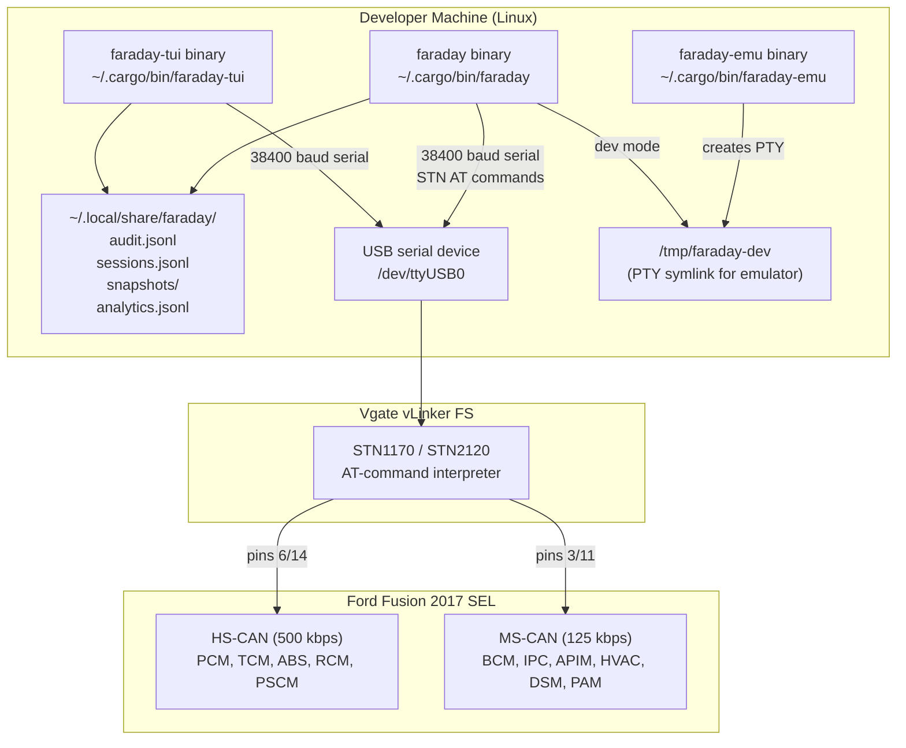

# faraday — Architecture Documentation

> arc42 template, ISO/IEC 42010-compliant. Diagrams use the C4 Model (Mermaid).
> Cross-references to existing protocol docs in `docs/` are indicated with arrows (→).

---

## 1. Introduction and Goals

### System Purpose

`faraday` is a Rust CLI tool for communicating with a Ford Fusion 2017 SEL via OBD-II.
It covers three classes of operation:

- **Standard diagnostics** — SAE J1979 (OBD-II): read/clear DTCs, live PIDs, VIN
- **Proprietary UDS reads** — ISO 14229 (UDS): as-built block dump, ECU info, per-module sessions
- **Configuration writes** — UDS Security Access + WriteDataByIdentifier, protected by mandatory snapshots

### Quality Goals

| Priority | Goal | Scenario |
|---|---|---|
| 1 | **Safety** | No permanent ECU damage from a write operation. Snapshot saved before every write. |
| 2 | **Protocol Correctness** | ISO-TP frames assembled and parsed per ISO 15765-2; J1979/UDS service IDs verified. |
| 3 | **Testability** | Full-stack tests runnable without hardware via `faraday-emu` PTY emulator. |
| 4 | **Ergonomics** | Readable CLI output and a live-data TUI with 10 diagnostic panels. |
| 5 | **Portability** | Linux primary (SocketCAN path open); macOS partial. |

### Stakeholders

| Role | Interest |
|---|---|
| Owner/developer | Run diagnostics, tune as-built configuration, extend the tool |
| Mechanic | Read and clear DTCs without FORScan license |
| FORScan community | Reference implementation for Ford protocol reverse-engineering |

---

## 2. Architecture Constraints

### Technical Constraints

| Constraint | Rationale |
|---|---|
| Rust stable, Cargo workspace | No FFI at runtime; `unsafe` only in `faraday-emu` (nix PTY) |
| tokio async runtime | All I/O is non-blocking; no `std::thread` in the hot path |
| Single adapter type today: Vgate vLinker FS | STN1170/STN2120 chipset; USB serial (Phase 1); Bluetooth planned |
| Serial baud rate 38400, 8N1, no flow control | VLinker FS hardware requirement |
| OBD-II connector J1962 | Vehicle-side physical interface |

### Organisational Constraints

| Constraint | Rationale |
|---|---|
| No CI pipeline | All quality gates are local: `make dev/check` (fmt → clippy → test) |
| Ford-proprietary seed→key XOR unvalidated | Algorithm (`seed XOR 0xB3CA_4057`) from community reverse-engineering; not confirmed against a real ECU |
| Data licensing | `faraday-asbuilt` block catalog derived from community as-built databases (no official Ford documentation) |

---

## 3. Context and Scope

### C4 Level 1 — System Context



### Scope Boundaries

**In scope:**
- SAE J1979 services: Mode 01 (live data), 03/07/0A (DTCs), 04 (clear), 09 (VIN)
- UDS services: 0x10 (session), 0x22 (read DID), 0x27 (security access), 0x2E (write DID), 0x3E (tester present)
- ISO-TP segmentation/reassembly (ISO 15765-2), single and multi-frame

**Out of scope:**
- UDS ECUReset (0x11)
- RoutineControl (0x31)
- IO Control (0x2F)
- SocketCAN / Linux kernel CAN interface (planned, not implemented)
- Bluetooth (btleplug, planned)

→ See `docs/UDS.md` for service details, `docs/SPEC.md §5` for full OBD-II command model.

---

## 4. Solution Strategy

### Five-Layer Trait Stack

Every protocol layer is separated by a Rust trait, making each layer independently testable
with mocks. The stack is compiled as zero-cost generics — no runtime dispatch in the
production hot path.

```
Commands   ←  business logic: DTC reads, as-built reads/writes, live PIDs
Protocol   ←  J1979 (SAE), UDS (ISO 14229) message encoding/decoding
Transport  ←  ISO-TP segmentation / reassembly (ISO 15765-2)
Link       ←  ELM327/STN AT-command adapter abstraction
Physical   ←  tokio-serial / SocketCAN (external to this crate)
```

Boundary traits:
- `LinkLayer` separates Physical from Transport
- `IsoTpTransport` separates Transport from Protocol/Commands

### Key Design Decisions (summary)

| Decision | Choice | ADR |
|---|---|---|
| Layer boundaries | Traits (`LinkLayer`, `IsoTpTransport`) | [ADR-001](adr/ADR-001-layered-trait-architecture.md) |
| Generic vs boxed | Generic `CommandExecutor<T>` — zero cost | [ADR-002](adr/ADR-002-generic-over-boxed.md) |
| Write safety | Mandatory snapshot before every write | [ADR-003](adr/ADR-003-snapshot-before-write.md) |
| Crate separation | `faraday-asbuilt` independent of `faraday-core` | [ADR-004](adr/ADR-004-asbuilt-separate-crate.md) |
| Test location | Inline `#[cfg(test)]`, not separate `tests/` | [ADR-005](adr/ADR-005-inline-tests.md) |
| Async serial I/O | `tokio-serial` + `async-trait` throughout | [ADR-006](adr/ADR-006-async-serial.md) |
| Hardware-free tests | PTY-based `faraday-emu` emulator crate | [ADR-007](adr/ADR-007-pty-emulator.md) |

### CAN Bus Strategy

The vehicle has two physically separate CAN buses. The adapter must switch between them
at the AT-command level (`STCP 24` for HS-CAN, `STCP 25` for MS-CAN). The `Module` enum
in `faraday-core::types` encodes which bus each ECU lives on; the transport layer performs
the switch automatically when `set_can_bus()` is called.

→ See `docs/HS-CAN.md` and `docs/MS-CAN.md` for full module address tables.

---

## 5. Building Block View

### C4 Level 2 — Container View



### C4 Level 3 — faraday-core Components



### C4 Level 3 — faraday-tui Components



### Crate Dependency Graph



### Public API Surface per Crate

**faraday-core**

| Item | Kind | Description |
|---|---|---|
| `LinkLayer` | trait | Physical adapter abstraction |
| `IsoTpTransport` | trait | ISO-TP send/receive abstraction |
| `VLinkerFs` | struct | STN1170 serial adapter implementation |
| `IsoTp<L>` | struct | ISO-TP over any `LinkLayer` |
| `CommandExecutor<T>` | struct | All high-level diagnostic operations |
| `Module` | enum | 11 ECU modules with CAN IDs and bus assignments |
| `CanId`, `CanFrame`, `CanBus` | structs/enum | CAN primitives |
| `Pid`, `PidValue`, `Dtc`, `DtcKind` | types | OBD-II data types |
| `Error`, `Result<T>` | type alias | Unified error type (`thiserror`) |

**faraday-asbuilt**

| Item | Kind | Description |
|---|---|---|
| `AsBuiltBlock` | struct | Block schema: DID + raw bytes + feature list |
| `Feature`, `BitPosition`, `FeatureType`, `FeatureValue` | types | Feature schema and decoded value |
| `AsBuiltDecoder` | unit struct | `decode_block()`, `decode_feature()` |
| `AsBuiltEncoder` | unit struct | `encode_feature()`, `set_bit_value()` |
| `AsBuiltSnapshot` | struct | Timestamped block dump for rollback |
| `save_snapshot()`, `load_snapshot()` | fn | JSON persistence |
| `bcm::get_known_blocks()` | fn | BCM catalog (6 features, DIDs 0x0701/0702) |
| `ipc::get_known_blocks()` | fn | IPC catalog (9 features, DIDs 0x0101/0102/0401) |
| `pcm::get_known_blocks()` | fn | PCM catalog (3 features, DID 0xE001) |

---

## 6. Runtime View

### Scenario A — `faraday read-dtc` (J1979 single-frame)



### Scenario B — `faraday asbuilt dump --module bcm` (UDS MS-CAN)



### Scenario C — `faraday asbuilt write` (Security Access + write)

```mermaid
sequenceDiagram
    participant CLI as faraday-cli
    participant SNAP as snapshot::save_snapshot
    participant CE as CommandExecutor
    participant IT as IsoTp
    participant ECU as ECU

    CLI->>CE: read_asbuilt_block(module, did)
    CE-->>CLI: current_data: Vec<u8>
    CLI->>SNAP: save_snapshot(path, snapshot{current_data})
    CLI->>CLI: prompt user confirmation (unless --yes)
    CLI->>CE: write_asbuilt_block(module, did, new_data)
    CE->>IT: Extended session (0x10 0x03)
    CE->>IT: RequestSeed (0x27 0x01)
    IT-->>CE: seed: [u8; 4]
    CE->>CE: compute_key(seed) → seed XOR 0xB3CA_4057
    CE->>IT: SendKey (0x27 0x02, key)
    IT-->>CE: [0x67, 0x02] (granted)
    CE->>IT: WriteDataByIdentifier (0x2E, did, new_data)
    IT-->>CE: [0x6E, did_echo]
    CE-->>CLI: Ok(())
    CLI->>CLI: AuditLogger::append(before, after, did, module)
```

### Scenario D — TUI engine tab poll loop



→ See `docs/DATA_FLOW.md` for byte-level detail on each flow.

---

## 7. Deployment View

### Physical Deployment



### Runtime Data Paths

| Path | Written by | Format |
|---|---|---|
| `~/.local/share/faraday/audit.jsonl` | `asbuilt write`, `asbuilt restore` | JSONL, one entry per write |
| `~/.local/share/faraday/sessions.jsonl` | Every `faraday` invocation | JSONL, one entry per session |
| `~/.local/share/faraday/snapshots/*.json` | `asbuilt write`, `asbuilt snapshot` | JSON `AsBuiltSnapshot` |
| `~/.local/share/faraday/analytics.jsonl` | TUI on exit | JSONL, session analytics |

---

## 8. Cross-Cutting Concepts

### Error Handling

- **Libraries** (`faraday-core`, `faraday-asbuilt`): `thiserror`-derived `Error` enum with
  named variants. Public `Result<T>` type alias. Never `unwrap()` or `expect()` in production
  paths.
- **Binaries** (`faraday-cli`, `faraday-tui`, `faraday-emu`): `anyhow::Result` with `?`
  propagation. Errors surface as formatted messages via `OutputFormatter::print_error()`.
- **UDS negative responses** are a dedicated variant: `Error::UdsNegativeResponse { service, code, description }`.
  The NRC code is mapped to a human-readable description in `protocol::uds`.

→ `faraday-core/src/error.rs` for the full variant list.

### Logging and Observability

- Every CAN frame sent and received is logged at `tracing::trace!` level.
- Adapter AT commands logged at `trace!`; higher-level operations at `debug!`.
- `tracing-subscriber` with `env-filter` feature — controlled via `RUST_LOG` env variable.
- Structured JSON logging available (`tracing-subscriber` `json` feature).

### Async Patterns

| Pattern | Where used | Notes |
|---|---|---|
| `async-trait` | `LinkLayer`, `IsoTpTransport` | Required for async methods in traits |
| `tokio::time::timeout` | `IsoTp::receive()` | Per-frame timeout (default 1000 ms) |
| `tokio::time::sleep(10ms)` | `VLinkerFs::receive_frame()` | Polling sleep — not fully async; see [ADR-006](adr/ADR-006-async-serial.md) |
| `JoinHandle<()>` | `Uds::tester_present_task` | Background TesterPresent keepalive, aborted on `Drop` |
| `Arc<Mutex<T>>` | Test mocks only | Never in production code |

### Safety Gates for Write Operations

1. **DID blocklist**: DIDs with prefix `0xF0xx` and `0xF1xx` (programming / identification DIDs)
   are rejected before any transport call.
2. **Mandatory snapshot**: `asbuilt write` and `asbuilt restore` read the current block data
   and persist a timestamped JSON snapshot *before* sending the write command.
3. **Security Access required**: `write_data_by_identifier()` checks `security_access_granted`
   flag; if false, returns `Error::Unsupported`.
4. **Dry-run mode**: `--dry-run` flag stops execution after logging the intended change.
5. **Double confirmation**: Interactive `y/N` prompt unless `--yes` flag is set.
6. **Audit trail**: Every write attempt (success or failure) appended to `audit.jsonl`.

### Formatting and Style

- `rustfmt.toml`: `max_width = 100`, `imports_granularity = "Crate"`, `group_imports = "StdExternalCrate"`
- No code comments except when WHY is non-obvious
- No `unwrap()`/`expect()` outside tests
- All public items carry `///` doc comments

---

## 9. Architecture Decisions

| ADR | Title | Status |
|---|---|---|
| [ADR-001](adr/ADR-001-layered-trait-architecture.md) | Layered trait architecture (`LinkLayer` + `IsoTpTransport`) | Accepted |
| [ADR-002](adr/ADR-002-generic-over-boxed.md) | Generic `CommandExecutor<T>` over boxed trait objects | Accepted |
| [ADR-003](adr/ADR-003-snapshot-before-write.md) | Mandatory snapshot before every write operation | Accepted |
| [ADR-004](adr/ADR-004-asbuilt-separate-crate.md) | `faraday-asbuilt` as independent data library | Accepted |
| [ADR-005](adr/ADR-005-inline-tests.md) | Inline `#[cfg(test)]` modules over separate `tests/` directory | Accepted |
| [ADR-006](adr/ADR-006-async-serial.md) | Async serial I/O with `tokio-serial` + `async-trait` | Accepted |
| [ADR-007](adr/ADR-007-pty-emulator.md) | PTY-based `faraday-emu` for hardware-free integration testing | Accepted |

---

## 10. Quality Requirements

### Quality Scenarios

| ID | Quality | Stimulus | Response |
|---|---|---|---|
| Q1 | **Safety** | User runs `asbuilt write` with wrong value | Snapshot saved before write; rollback via `asbuilt restore` |
| Q2 | **Safety** | User attempts to write a programming DID (0xF1xx) | Operation rejected before any CAN frame is sent |
| Q3 | **Correctness** | Multi-frame ISO-TP payload (1–4095 bytes) | Reassembled without data loss or sequence errors (proptest) |
| Q4 | **Correctness** | ECU returns UDS negative response 0x7F | `Error::UdsNegativeResponse` with human-readable NRC description |
| Q5 | **Testability** | Developer has no OBD-II adapter | Full stack test via `faraday-emu` PTY — `make tui/emu` |
| Q6 | **Performance** | TUI live data panel | Screen redraws at ≤ 100ms tick; engine panel polls at 250ms |
| Q7 | **Ergonomics** | User wants to configure DRL on BCM | Single command: `faraday asbuilt write --module bcm --feature drl_enabled --value 1` |
| Q8 | **Portability** | Linux kernel CAN (SocketCAN) adapter | `LinkLayer` trait allows drop-in `SocketCanLink` implementation |

---

## 11. Risks and Technical Debt

| ID | Risk | Severity | Mitigation |
|---|---|---|---|
| R1 | Seed→key XOR `0xB3CA_4057` not validated against real ECU | HIGH | Manual validation guide in `docs/guides/HARDWARE_VALIDATION.md`; writes guarded by dry-run default |
| R2 | No CI pipeline | MEDIUM | Local `make dev/check` gate; documented in CLAUDE.md |
| R3 | `faraday-cli` has zero automated tests | MEDIUM | Emulator covers end-to-end paths; unit tests cover core and asbuilt |
| R4 | `faraday-tui` uses concrete `VLinkerFs` (no trait object) | LOW | Cannot mock adapter in TUI without refactor to `Box<dyn LinkLayer>`; see [ADR-002](adr/ADR-002-generic-over-boxed.md) |
| R5 | `nom` listed as workspace dependency but unused in current sources | LOW | Dead dependency — safe to remove from `faraday-core/Cargo.toml` |
| R6 | `faraday-tui` does not depend on `faraday-asbuilt` | LOW | As-built display/configuration impossible in TUI without adding the dependency |
| R7 | `tokio::time::sleep(10ms)` polling in `VLinkerFs::receive_frame()` | LOW | Not truly async; burns CPU when waiting; see [ADR-006](adr/ADR-006-async-serial.md) |
| R8 | TesterPresent background task is a no-op stub | LOW | Extended session may time out on long operations; `start_tester_present()` needs implementation |

---

## 12. Glossary

| Term | Definition |
|---|---|
| **As-built** | Factory configuration data stored in each ECU as bit-packed bytes, addressed by UDS DID |
| **CAN** | Controller Area Network — serial bus protocol used for in-vehicle communication |
| **DID** | Data Identifier — 16-bit UDS address for a named data record within an ECU |
| **DTC** | Diagnostic Trouble Code — fault code stored by an ECU when an abnormality is detected |
| **ECU** | Electronic Control Unit — embedded computer controlling a vehicle subsystem |
| **ELM327 / STN** | Families of OBD-II interpreter chipsets; faraday targets the STN1170/STN2120 |
| **HS-CAN** | High-Speed CAN — 500 kbps bus (pins 6/14), powertrain modules |
| **ISO-TP** | ISO 15765-2 — transport protocol for CAN messages larger than 8 bytes |
| **KOEO** | Key On, Engine Off — required state for safe as-built writes |
| **MS-CAN** | Medium-Speed CAN — 125 kbps bus (pins 3/11), body/comfort modules |
| **NRC** | Negative Response Code — UDS byte in service 0x7F indicating why a request was rejected |
| **OBD-II** | On-Board Diagnostics II — standardised vehicle diagnostic interface (SAE J1979, ISO 15031) |
| **PID** | Parameter ID — OBD-II identifier for a live sensor value (e.g., engine RPM = 0x0C) |
| **Seed-key** | Challenge-response authentication in UDS service 0x27; ECU sends seed, tool computes key |
| **Snapshot** | JSON dump of an ECU's as-built block taken immediately before a write, used for rollback |
| **UDS** | Unified Diagnostic Services — ISO 14229 ECU communication protocol |

→ Protocol detail: `docs/UDS.md`, `docs/DTCs.md`, `docs/DIDs.md`, `docs/AsBuilt.md`
→ Hardware detail: `docs/HS-CAN.md`, `docs/MS-CAN.md`, `docs/Adapters.md`
→ Full technical specification: `docs/SPEC.md`
