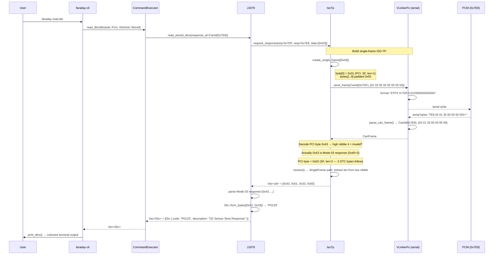
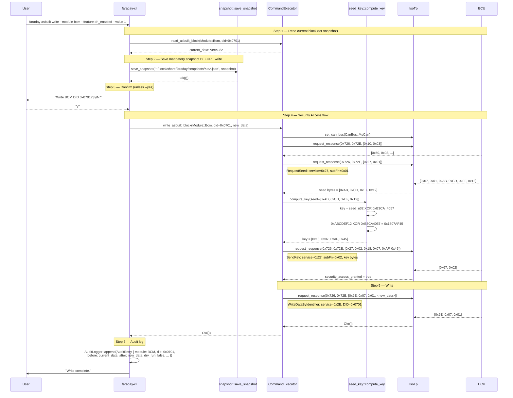
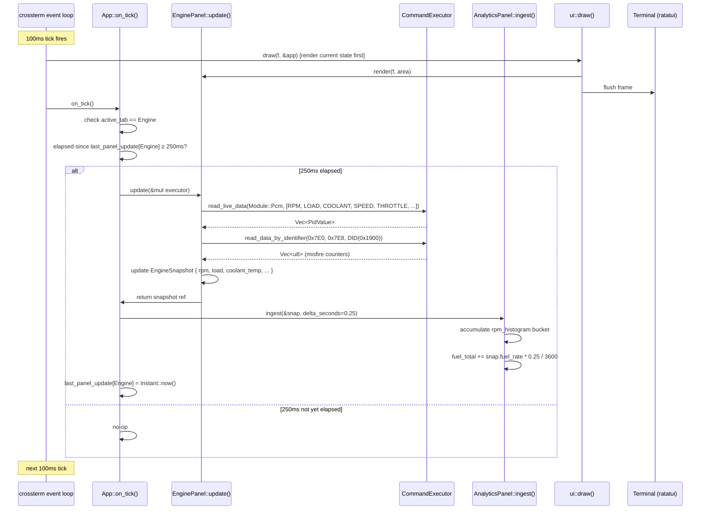

# faraday — Protocol Data Flow Reference

Byte-level sequence diagrams for the four major operation flows.
For architectural context see `docs/ARCHITECTURE.md §6`.

---

## 1. J1979 OBD-II Single-Frame Read (`read-dtc`, `live`)

Covers any Mode 01/03/04/07/09/0A request where the ECU reply fits in a single CAN frame
(payload ≤ 7 bytes). Mode 03 (stored DTCs) on a healthy engine typically returns 0–2 DTCs.



### Key Byte Encoding

| Step | Bytes on wire | Meaning |
|---|---|---|
| Request (Mode 03) | `7DF#01 03 55 55 55 55 55 55` | SF PCI=0x01 (len=1), service=0x03, pad=0x55 |
| Response (2 DTCs) | `7E8#04 43 01 33 05 00 00 00` | SF PCI=0x04 (len=4), 0x43=Mode03+0x40, 2×2-byte DTC |
| DTC decode | `[0x01, 0x33]` | Bits 15-14=00→P, code=0133 → P0133 |

---

## 2. UDS As-Built Block Read (`asbuilt dump --module bcm`)

Multi-frame ISO-TP read over MS-CAN. The BCM responds with a DID payload longer than
7 bytes, requiring a First Frame / Flow Control / Consecutive Frame exchange.

```mermaid
sequenceDiagram
    participant CLI as faraday-cli
    participant CE as CommandExecutor
    participant IT as IsoTp
    participant VL as VLinkerFs
    participant BCM as BCM (0x72E)

    CLI->>CE: read_asbuilt_block(Module::Bcm, did=0x0701)
    CE->>IT: set_can_bus(CanBus::MsCan)
    IT->>VL: send AT command "STCP 25\r"
    VL-->>IT: "OK\r>"

    Note over CE,BCM: Enter Extended Diagnostic Session (UDS 0x10 0x03)
    CE->>IT: request_response(0x726, 0x72E, [0x10, 0x03])
    IT->>VL: send_frame([02 10 03 55 55 55 55 55])
    BCM-->>VL: "72E,02 50 03 00 19 01 F4\r>"
    VL-->>IT: CanFrame { id: 0x72E, [02 50 03 ...] }
    IT-->>CE: [0x50, 0x03, 0x00, 0x19, 0x01, 0xF4]

    Note over CE,BCM: ReadDataByIdentifier (UDS 0x22 + DID 0x0701)
    CE->>IT: request_response(0x726, 0x72E, [0x22, 0x07, 0x01])
    IT->>IT: create_single_frame([0x22, 0x07, 0x01])
    IT->>VL: send_frame(0x726, [03 22 07 01 55 55 55 55])

    BCM-->>VL: "72E,10 0A 62 07 01 A3 B7 C1\r>"
    Note right of BCM: First Frame: PCI=0x10, total_len=0x000A (10 bytes)<br/>first 6 data bytes: [62 07 01 A3 B7 C1]
    VL-->>IT: CanFrame (FF)
    IT->>IT: decode FF: len=10, data_so_far=[62 07 01 A3 B7 C1]

    Note over IT,BCM: Send Flow Control (ContinueToSend)
    IT->>VL: send_frame(0x726, [30 00 00 55 55 55 55 55])
    Note right of IT: FC: PCI=0x30, block_size=0, STmin=0

    BCM-->>VL: "72E,21 D5 E2 55 55 55 55 55\r>"
    Note right of BCM: CF seq=1: [D5 E2] → remaining 4 bytes (incl. 0x55 pad)
    VL-->>IT: CanFrame (CF seq=1)
    IT->>IT: append [D5, E2]; total assembled = [62 07 01 A3 B7 C1 D5 E2] (8 bytes, len=10?)

    IT-->>CE: Vec<u8> = [0x62, 0x07, 0x01, 0xA3, 0xB7, 0xC1, 0xD5, 0xE2]
    CE->>CE: strip UDS positive response header [0x62, 0x07, 0x01]
    CE-->>CLI: raw block data [0xA3, 0xB7, 0xC1, 0xD5, 0xE2]
    CLI->>CLI: AsBuiltDecoder::decode_block() → FeatureValue list
    CLI->>CLI: print_asbuilt_dump()
```

### ISO-TP Frame Types

| PCI High Nibble | Frame Type | Description |
|---|---|---|
| 0x0 | Single Frame (SF) | Full payload in one CAN frame (≤ 7 bytes) |
| 0x1 | First Frame (FF) | Start of multi-frame; 12-bit length in bytes 0-1 |
| 0x2 | Consecutive Frame (CF) | Continuation; sequence number in low nibble |
| 0x3 | Flow Control (FC) | Sent by receiver to authorise more CF frames |

---

## 3. Security Access + Write (`asbuilt write`)

The most complex flow: snapshot → extended session → seed-key exchange → write → audit.



### DID Safety Blocklist

Before step 4, `write_asbuilt_block` checks the DID prefix:

| DID range | Action |
|---|---|
| `0xF0xx` (programming DIDs) | Rejected — `Error::Unsupported` |
| `0xF1xx` (identification DIDs) | Rejected — `Error::Unsupported` |
| All other DIDs | Proceed with Security Access + Write |

---

## 4. TUI Engine Tab Poll Loop

The TUI does not use a dedicated networking thread. All CAN I/O happens within the single
tokio task driven by the crossterm event loop.



### Panel Poll Intervals

| Tab | Key | Poll interval | Notes |
|---|---|---|---|
| Engine | `1` | 250 ms | Highest frequency — live gauges |
| Transmission | `2` | 500 ms | TCM DIDs 0xDD01-0xDD03 |
| Body | `3` | 1 s | BCM DIDs |
| Safety | `4` | 1 s | ABS/RCM DIDs |
| ADAS | `5` | 1 s | PAM ultrasonic DIDs |
| Climate | `6` | 1 s | HVAC DIDs |
| Infotainment | `7` | 5 s | APIM DIDs, slow-changing |
| Analytics | `8` | 5 s | Derived from engine snapshots, no I/O |
| Health | `9` | 5 s | DID 0xF101 on 9 modules, round-robin |
| Glossary | `0` | 60 s | Static data, no I/O |

Only the **active tab** is polled. Off-screen panels do not accumulate new data.

---

## Cross-Reference

| Topic | Document |
|---|---|
| Layer architecture | `docs/ARCHITECTURE.md §5-6` |
| UDS service codes | `docs/UDS.md` |
| DID catalog | `docs/DIDs.md` |
| CAN module addresses | `docs/HS-CAN.md`, `docs/MS-CAN.md` |
| As-built block schema | `docs/AsBuilt.md` |
| Hardware validation | `docs/guides/HARDWARE_VALIDATION.md` |
